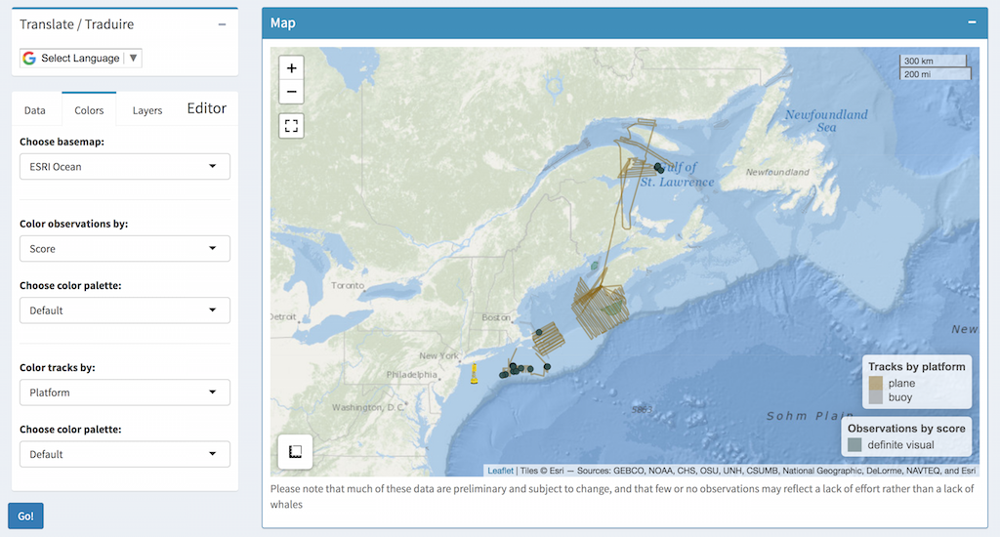
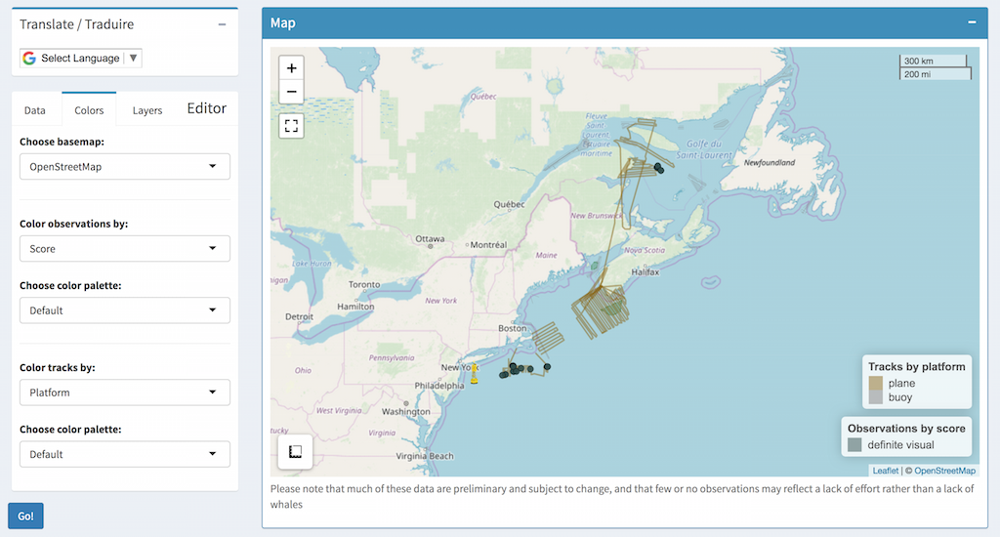
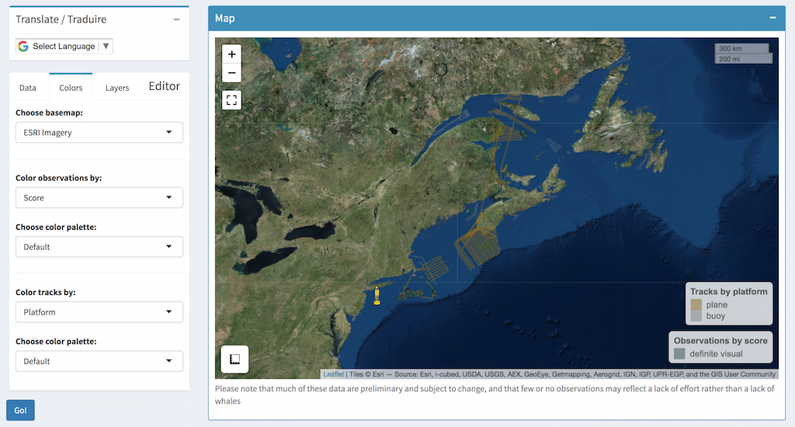
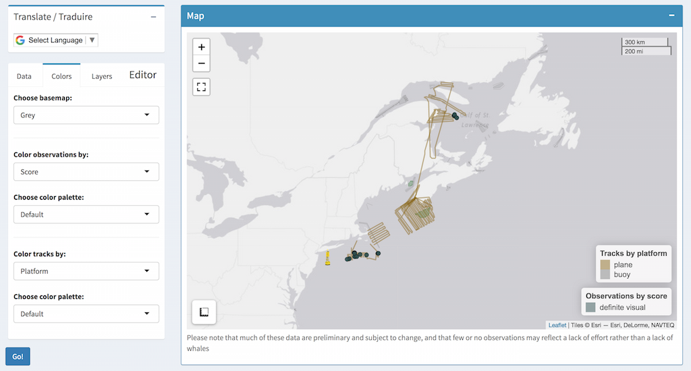

The following is a brief overview of how to use the WhaleMap shiny app to customize the display of survey data. If you have further questions or requests, please submit a [GitHub issue ](https://github.com/hansenjohnson/WhaleMap/issues) or emailed Hansen directly (hansen.johnson@dal.ca).

[Back to the app](https://whalemap.org/WhaleMap/)

***

# Whale survey data

Large whale surveys typically include **observation** and **effort** data. Observations provide information about the occurrence of a given species at a particular time and location. These observations can be obtained visually (i.e., a whale is seen at the surface by an observer) and/or acoustically (i.e., a whale call is detected on an underwater microphone). Observations appear as circles on WhaleMap.

Effort data provide information on the time and location where whale surveys were conducted. This information is *extremely important* for interpreting patterns in whale observations. For example, areas with no survey effort likely have little or no information on whale presence.

# Selecting input data

All the inputs are selected using the small column on the left side of the application. By default, the application shows the "Data" tab. This tab includes filters that allow you to select the **Date**, **Platform**, **Species**, **Data sources**, and **Data layers**. Once the desired filters are selected, click the **Go** button on the bottom left of the screen to update the display. More information on each filter are provided below:

## Date 

Choose the time range of the data to be displayed. There are 3 options here. You can select a `Specific date`, an inclusive `Date range`, or a `Range among years`. The latter is useful for comparing a small time range (i.e., 1 month) over several years. Use the radio buttons to choose which filter you would like to use, then use the date picker or slider to configure desired the date range.

## Platform

Here "platform" essentially refers to the type of vehicle that was used to perform the survey.

* `Plane`: aerial visual survey using a piloted aircraft with human observers  
* `Vessel`: shipboard visual survey  
* `RPAS`: aerial survey using a Remotely Piloted Aircraft System (RPAS)  
* `Opportunistic`: verified sighting report, typically not from a dedicated whale survey  
* `Slocum Glider`: acoustic survey using an autonomous vehicle known as a Slocum glider  
* `Buoy`: acoustic survey using an autonomous moored buoy  

## Species

Choose to display observations of the following species:  

* North Atlantic right whale (*Eubalaena glacialis*)  
* Fin whale (*Balaenoptera physalus*)  
* Sei whale (*Balaenoptera borealis*)  
* Humpback whale (*Megaptera novaeangliae*)  
* Blue whale (*Balaenoptera musculus*)  

## Data sources  

Choose from the following data sources:  

* [WhaleMap](https://www.whalemap.org/): Observations (visual and acoustic) and effort submitted in near-real time to WhaleMap from contributors based in the US  
* [NARWC](https://www.narwc.org/sightings-database.html): Validated sightings and effort from the North Atlantic Right Whale Consortium (NARWC) archive  
* [WhaleInsight](https://gisp.dfo-mpo.gc.ca/apps/WhaleInsight/eng/?locale=en): Observations (visual and acoustic) and effort submitted in near-real time to Whale Insight from contributors based in Canada  
* [RWSAS](https://www.fisheries.noaa.gov/resource/map/north-atlantic-right-whale-sightings): Validated sightings contributed to NOAA in near real-time  

## Data layers

Choose to display `Effort`, `Possible observations`, and/or `Definite observations`. Both observations and effort are defined in more detail above. `Definite observations` are those in which the species identity could be confidently determined, while `Possible observations` indicate some uncertainty in the species identity.

***Note*** - Effort is automatically switched off if the number of data points requested exceeds the maximum threshold. This is accompanied by a warning message.

## Show unverified data

Data contributors and managers may enter a password here to reveal unverified observations.

# Coloring survey data

Observations and effort data can be colored by different variables to improve visualization. This is achieved by clicking on the `Colors` tab at the top left of the application.

## Color observations 

By default, the observations are colored by `Score` using the default color map. Use the dropdown menus to select the variable and color palette to use. Don't foreget to click **Go** when you're done to update the display.

## Color effort

Effort data can also be color-coded according to different variables. As with observations, use the variable and color palette to use.

**Pro tip** - If it starts looking messy, try switching to a different basemap (see below - grey often works well)

# Map layers

Click on the `Layers` tab at the top left of the application to customize the appearance of the map and the data layers that are displayed.

## Choose from different basemaps {.tabset}

Use the `Choose basemap:` dropdown menu to select the background you would like. Remember to click `Go` in the bottom left to plot the new map. 

### ESRI Ocean

### OpenStreetMap

### ESRI Imagery

### Grey

## Map layers

* `Graticules` overlay lines of latitude and longitude  
* `Latest robot positions` overlays icons showing the latest positions of autonomous platforms conducting acoustic surveys (moored buoys and Slocum gliders)  
* `Shipping lanes` overlays the established shipping lanes  
* `Legends` optionally show/hide the map legends  

## Management layers

We strive to include the latest management layers for both the US and Canada. These have changed substantially over the years. For further information, click the round info next to a given management layer. Note that many of these layers are clickable and provide additional information when clicked on the map.

[Back to the app](https://whalemap.org/WhaleMap/)
