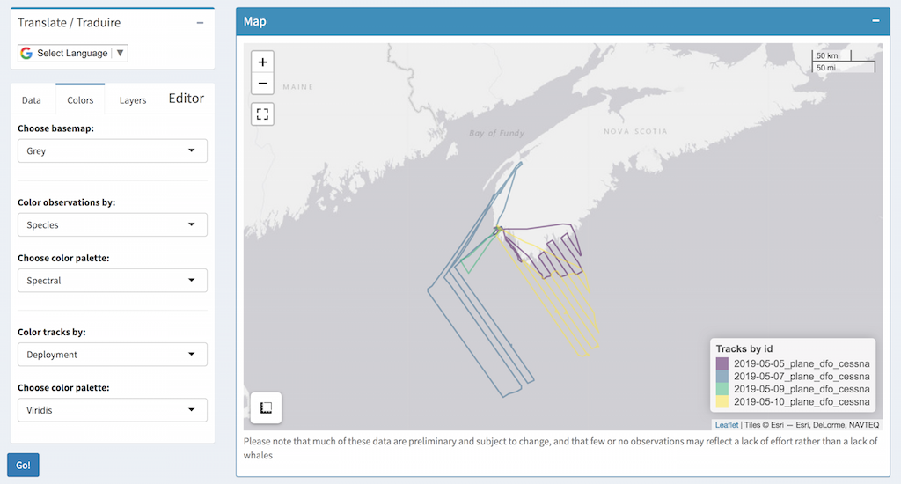
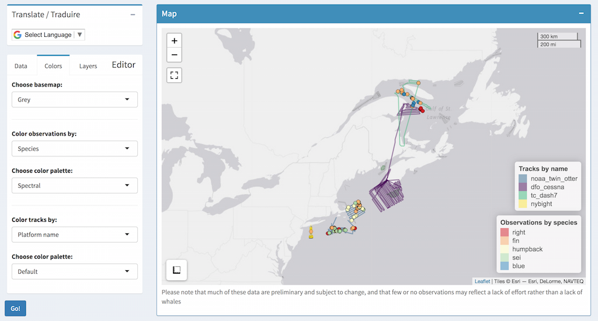
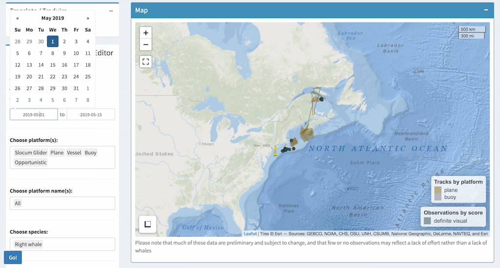
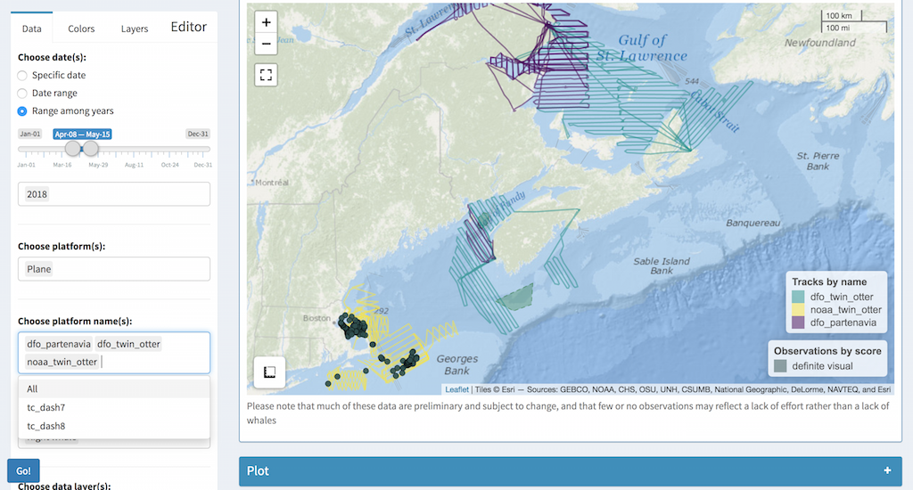
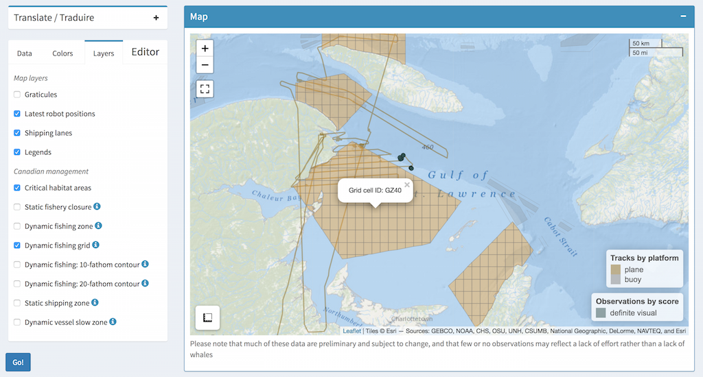

The following is a brief overview of how to use the WhaleMap shiny app to customize the display of survey data. If you have further questions or requests, please submit a [GitHub issue ](https://github.com/hansenjohnson/WhaleMap/issues) or emailed Hansen directly (hansen.johnson@dal.ca).

[Back to the app](https://whalemap.org/WhaleMap/)

***

## Choose from different basemaps {.tabset}

Click on the `Colors` tab on the Editor pane, then use the `Choose basemap:` dropdown menu to select the background you would like. Remember to click `Go` in the bottom left to plot the new map. 

### ESRI Ocean

### OpenStreetMap

### ESRI Imagery

### Grey

## Color track lines by variable

Click on the `Colors` tab on the Editor pane, then use the `Color tracks by` dropdown to select the variable you would like to colorcode. Then use the `Choose color palette` dropdown to pick a set of colors you would like. 

**Pro tip** - If it starts looking messy, try switching to a different basemap (Grey often works well)

You can get creative and color tracks and detections by different variables

## Select date range

Click the `Data` tab on the Editor pane, then click the `Date range` button underneath the `Choose date(s)`. This should bring up two date fields. You can type in the date range you like (using YYYY-MM-DD format), or select them using the popup calendar widgets.

## Select platform by name

Use the `Choose platform name(s)` to select specific platforms, such as a specific plane or vessel, you would like to display. The choices that appear are based on the date range selected above. *Make sure you remove the `All` option to only show specific platforms*

## Interactive management layers

Canadian management is more extensive this year. Switch to the `Layers` tab and scroll down to `Canadian Management` section to turn specific layers on and off. Note that some of them (e.g., Fishing grid) are clickable so you can extract information about a particular layer.

[Back to the app](https://whalemap.org/WhaleMap/)
